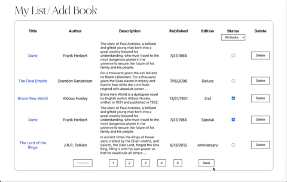
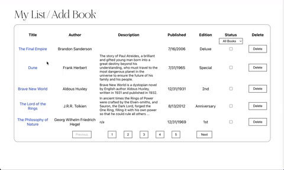
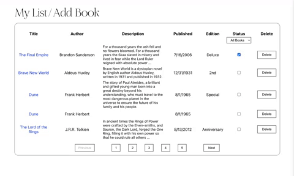
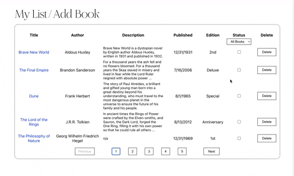

# librairie

## Date: 8/4/22
#### By: Alissa Wiley | [Portfolio](https://alissaestelle.com/) | [LinkedIn](https://www.linkedin.com/in/alissaestelle/)
 

## **_Description_**

This app serves as a personal book tracker where a user can manage their collection by adding, updating, or deleting books. It features a scrollable "bookshelf" of daily recommendations hosted by [Google Books API](https://developers.google.com/books/docs/v1/using) as well as an interactive table to manage personal book preferences.

 

The user's personal book collection is formatted as a paginated list that displays 5 books per page. The maximum amount of pages are set to dynamically update as books are added/deleted. This list also contains a check in/out status for each book. Whenever a book is checked in/out, its status is automatically updated within the database. Books can also be sorted by status.

---

**_Getting Started_**
-
Repo can be forked & cloned, and dependencies can be installed by running: _npm i_.
  
Note: This app has Concurrently installed. In the terminal, /cd into the server file and run *npm run dev* to spin up both the React site and the server simultaneously.
 

1. To add a new book to the collection, click _Add Book_.

2. To update a book, click on its title.

4. To delete a book, click _Delete_.

6. To check a book in or out, click the checkbox in its table row. An empty checkmark means a book is currently available.
7. To filter books by status, select an option from the drop-down menu in the book status column.

A starter collection has already been seeded from the database!

---

**_Technologies_**
- 

- Postgres/PSQL
- Sequelize
- Express/Cors/Morgan
- Node/Nodemon
- Google Books API

---

**_Credits_**
-

Pagination:
[Academind](https://academind.com/tutorials/reactjs-pagination) | [LogRocket Blog](https://blog.logrocket.com/react-pagination-scratch-hooks/) | [freeCodeCamp](https://www.freecodecamp.org/news/build-a-custom-pagination-component-in-react/)

APIs: [Google Books API](https://developers.google.com/books/docs/v1/using)

